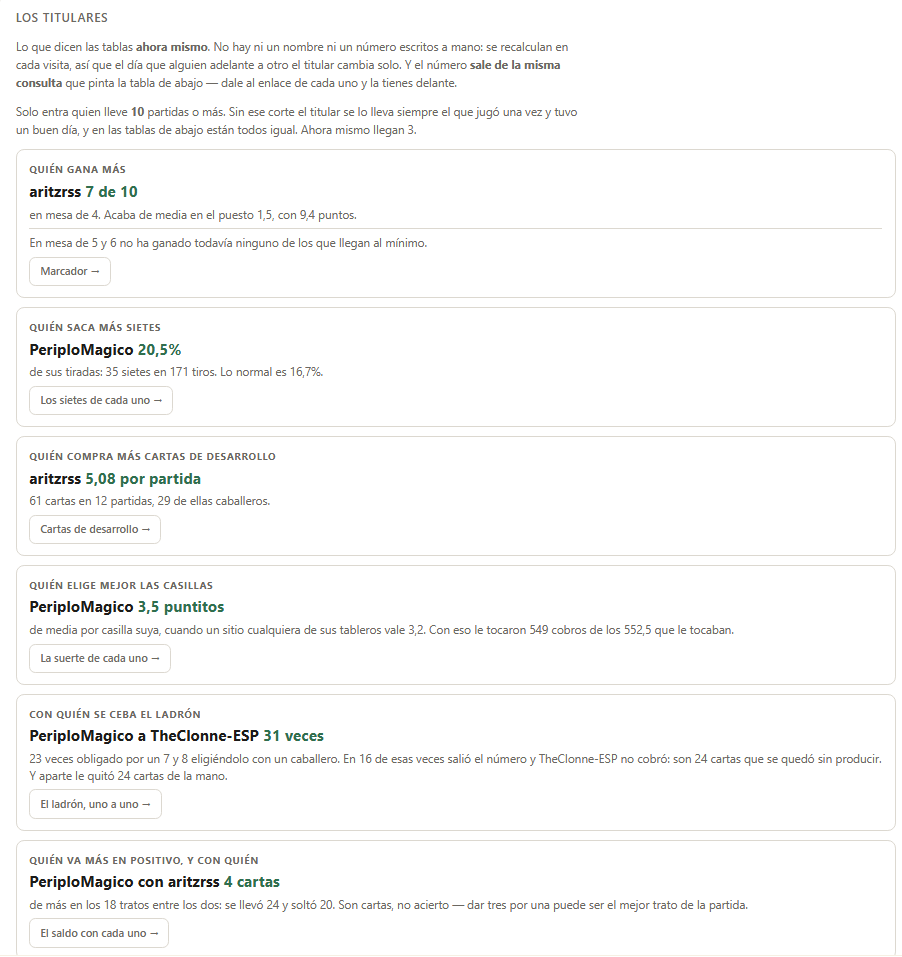
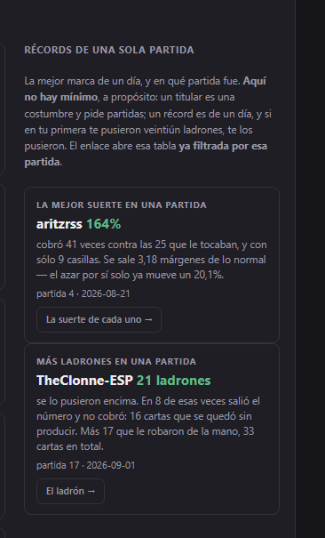

# Catan Tracker

Tus partidas de **Catan Universe**, apuntadas solas y convertidas en
estadísticas: quién gana, quién tiene suerte con los dados, dónde pone cada
uno el ladrón, quién comercia con quién y quién sale ganando.

No hay que apuntar nada a mano. Juegas, le das a un botón y ya está.

---

## Empezar

Necesitas **Python 3.7 o más nuevo** y **Catan Universe** en Steam. Nada más.

```powershell
py panel.py --simple
```

Se abre una página en el navegador. Todo se hace desde ahí, con botones.

> `py` no es una errata: es el lanzador de Python de Windows, y funciona
> aunque `python` no esté en el PATH. Si te da error, ése suele ser el
> motivo.

**No hay que instalar dependencias.** `requirements.txt` está vacío a
propósito: esto funciona con la biblioteca estándar de Python y nada más. No
hay `pip install` que pueda fallarte.

---

## Los cuatro pasos

El panel te los da en orden y te dice en cuál estás.

### 0 · Dejar el mod listo

Sale sólo si falta algo. Un botón: busca Catan preguntándoselo a Steam, mira
si es de 32 o de 64 bits, se descarga lo que hace falta, **comprueba su
huella SHA-256** antes de tocar nada y lo deja **apagado**.

### 1 · Jugar

**Encender el mod** → abre Catan → juega lo que quieras → **Parar y apagar el
mod**.

El orden importa: el mod se carga al arrancar el juego, así que enciéndelo
*antes* de abrir Catan. Puedes jugar varias partidas seguidas sin tocar nada.

### 2 · Guardar en la base de datos

Otro botón. Se puede dar las veces que quieras: las partidas que ya están no
se repiten.

La primera vez que juegue alguien nuevo saldrá con un nombre provisional
(`jugador_4645eb8a`). Ponle el suyo con **Ponerle nombre a alguien** y se
arreglan también las partidas ya guardadas.

### 3 · Mirar los datos

Arriba, **los titulares**: conclusiones ya escritas — quién gana más, a quién
le sale el 7 más de la cuenta, quién elige mejor las casillas — cada una con
el número que la sostiene y un enlace a la tabla de donde sale. No hay ni un
nombre escrito a mano: salen de las mismas consultas que pintan las tablas,
se recalculan en cada visita y sólo entran los que llevan 10 partidas o más,
para que no se lo lleve el que jugó una vez y tuvo un buen día.



Y debajo los **récords**: la mejor marca de una sola partida, con la partida
en que fue. Ahí no hay mínimo — un titular es una costumbre y pide partidas;
un récord es de un día.



*El panel arranca en claro o en oscuro según lo que prefiera tu sistema, y
hay un botón para cambiarlo cuando quieras.*

Y dos filtros que se combinan: **con quién** se jugó —de serie sólo las
de personas, porque la IA no propone tratos ni bloquea igual— y **de
cuántos era la mesa**, porque una de 5 o 6 tiene 30 casillas en vez de 19 y
se juega a 12 puntos y no a 10. Mezclarlas no ensucia la media un poco: la
deja sin significado.

Debajo, 32 tablas. El marcador, la suerte de cada uno, el ladrón, los
comercios, las cartas de desarrollo, los números de cada casilla… Y una caja
donde escribes la pregunta en cristiano:

```
¿quién ha tenido más suerte?
¿cuántos caballeros ha jugado Pedro?
¿quién le pone el ladrón a quién?
```

Si la respuesta no está en ninguna tabla, **lo dice** en vez de inventársela.

Qué quiere decir exactamente cada columna está en [db/columnas.py](db/columnas.py), que es el único sitio donde se explica.
---

## Lo que apunta, y lo que no

Apunta **sólo lo que ve todo el mundo** en la mesa: construcciones, tiradas,
comercios, el ladrón, quién roba a quién, la producción de cada uno.

**Nunca** las manos de nadie, ni los puntos escondidos de las cartas, ni qué
carta se lleva un robo, ni lo que descarta cada uno con el 7. No es que no se
guarde: es que **ni se mira**, y hay pruebas que lo comprueban.

Una partida ocupa unos pocos KB. No guarda ni una captura de pantalla.

**Tus datos son tuyos y no salen de tu ordenador.** La base (`catan_stats.db`)
se crea en la carpeta del proyecto y no se sube a ningún sitio. Este
repositorio no trae ni una partida de nadie: empiezas con la base vacía y la
llenas jugando.

---

## Antes de encender el mod, léete esto

El mod modifica el cliente de Catan Universe, y **las condiciones de uso del
juego lo prohíben**. Que sólo lea información pública no cambia eso.

Se carga en **todas** las partidas mientras esté encendido, también las
online con gente. Por eso el interruptor:

- viene **apagado** de fábrica y nunca se enciende solo,
- lo enciendes tú, a sabiendas,
- y el panel te lo pone en rojo en lo alto de la pantalla mientras está
  encendido, para que no se te olvide apagarlo.

La decisión es tuya y el riesgo también.

---

## Si algo no va

| | |
|---|---|
| `py` no se reconoce | instala Python desde python.org y marca «Add to PATH» |
| No encuentra Catan | abre Steam una vez y recarga la página |
| El mod no apunta nada | ¿lo encendiste **antes** de abrir Catan? |
| El panel no responde | se cerró la ventana negra; vuelve a abrirla |
| Sale una banda roja de «el panel se ha quedado atrás» | cierra la ventana negra y ábrela otra vez |

---

## Cómo saber si te está contando la verdad

Es un proyecto sobre datos, así que la pregunta importa:

```powershell
py db/pruebas.py
```

**Trescientas comprobaciones** sobre tus propias partidas: que el total y
cada partida por separado digan lo mismo, que los robos hechos cuadren con
los sufridos, que nadie tenga puntos imposibles, que la producción deducida
del tablero coincida con la apuntada.

No se dice el número exacto a propósito: sube con cada partida que juegas,
porque buena parte se hacen una vez por partida. El tuyo lo tienes al final
de la ejecución.

Y la base se abre **en solo lectura** desde el panel y desde las consultas.
Lo único que borra es el botón de quitar una partida, y hace copia antes.

---

## Y si quieres mirar por dentro

Todo está en SQL, sin nada escondido:

```powershell
py sql.py "SELECT * FROM amigos_marcador"
py sql.py --tablas
```

Y el catálogo entero — las **32 vistas** agrupadas, qué contesta cada una,
qué quiere decir cada columna y un ejemplo de cada tabla — te lo escribes
con:

```powershell
py db/catalogo.py
```

Deja un `VISTAS.md` de unas cincuenta páginas. **No viene en el repositorio y
no está escrito a mano**: sale de [db/columnas.py](db/columnas.py), que es el
único sitio donde se explica cada columna, y una prueba comprueba que el
fichero generado está al día. Si algún día una vista cambia y el `.md` no, la
prueba lo canta.

## Licencia

MIT. Ver [LICENSE](LICENSE).
